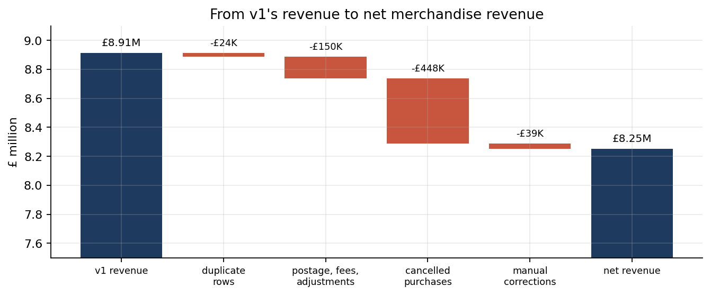
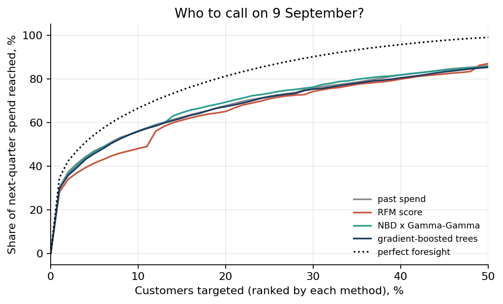

# Online Retail: Revenue, RFM and Customer Value

**A year of a UK online wholesaler's invoices (541,909 lines), cleaned with a ledger that accounts for every pound, segmented by RFM, and tested on the question RFM only gestures at: who will actually buy next quarter?**

**At a glance**

| | |
|---|---|
| **Question** | How much did a UK online wholesaler really earn, and which customers will buy next quarter? |
| **Data** | UCI Online Retail: 541,909 invoice lines, Dec 2010 to Dec 2011 |
| **Result** | £8.25M net revenue (the first version overstated it by 8%); 58% of customers labelled "At risk" bought again within a quarter |
| **Stack** | Python, pandas, SciPy, an offline SVG dashboard |

Data: [UCI Online Retail](https://archive.ics.uci.edu/dataset/352/online+retail) (Chen, Sain and Guo 2012; CC BY 4.0), 1 December 2010 to 9 December 2011. Many customers are themselves retailers.

**Notebook:** [`notebooks/customer_value.ipynb`](notebooks/customer_value.ipynb), step by step, every number printed by a cell. **Dashboard:** [`dashboard.html`](dashboard.html), one offline file with hand-built SVG charts.

## What changed in v2, and why

v1 (February 2026) reported £8.91M of revenue. It dropped cancelled invoices, but not the purchases they cancelled.



| | v1 | v2 |
|---|---|---|
| Revenue | £8,911,408 | **£8,250,372** net merchandise revenue (v1 overstated it by 8.0%) |
| Customers / orders | 4,338 / 18,532 | 4,324 / 18,275 |
| Typical order | mean £481 | median £298 (mean £451) |
| Champions' share of revenue | 51% | 53.6%; and the top 10% of customers bring **60.0%** (Gini 0.70) |
| At-risk customers | 646 holding £1.04M | 640 holding £0.91M; **58% of them bought again within a quarter** |
| December 2011 slump | in the monthly chart | December 2011 has 8 trading days; per day, November is the peak |

- **Cancelled orders were counted as sales: £447,848.** Every cancellation is now netted against the purchase it reverses, matched on customer, product and unit price. Three orders alone were worth £284,920 in v1: 80,995 paper-craft sets and 74,215 storage jars, each cancelled within 16 minutes, which made two customers the 4th and 10th biggest in the business; and a basket mis-keyed at £649.50 instead of £4.95.
- **Postage, carriage, Amazon fees and manual adjustments (£149,981) were counted as merchandise**, and 5,225 exact duplicate rows were kept.
- The bridge from v1's figure to net revenue closes to the penny.

## Does the segmentation predict anything?

Every customer was scored on data up to 9 September 2011, then checked against the next 13 weeks, which the scoring never saw:

| RFM segment (Sep 2011) | Bought again in the next 13 weeks | Share of next quarter's revenue |
|---|---|---|
| Champions | 89.5% | 50.5% |
| Loyal | 73.9% | 25.8% |
| At risk | 58.4% | 7.8% |
| Recent / one-off | 48.0% | 5.3% |
| Hibernating | 36.9% | 10.6% |

The labels carry real signal, but "At risk" overstates it: in a wholesale business a quiet spell is often just the gap between orders.

## Forward-looking value, and a ranking contest

The BG/NBD and Gamma-Gamma models (Fader, Hardie and Lee 2005) are implemented from their likelihoods in `src/retail.py`, using only `scipy`.

- **BG/NBD finds no dropout.** Its dropout parameter runs to infinity and allowing dropout improves the fit by less than one log-likelihood point: within nine months these customers do not "buy, then vanish". The model collapses to NBD, whose forecast is `t (r + x) / (alpha + T)`.
- **Its forecasts are right in shape and about a quarter too low** (4,441 purchase days happened against 3,336 forecast), because the test quarter is the Christmas peak and one year of data cannot teach a model seasonality.
- **Who to call on 9 September?** Ranked four ways and judged on actual next-quarter spend:

| Ranking | Spearman | Share of next-quarter spend in the top 20% |
|---|---|---|
| Past spend | 0.53 | 67.7% |
| RFM score | 0.53 | 65.1% |
| NBD x Gamma-Gamma | 0.51 | **69.3%** |
| Gradient-boosted trees (trained on an earlier quarter) | 0.51 | 67.3% |
| Perfect foresight | | 81.2% |

The simplest rule ranks almost as well as the models. Their real addition is a forecast in units (purchase days, pounds), and RFM quartiles are worst at the top of the list because they cannot tell a £2,000 customer from a £200,000 one. Of the 640 At-risk customers today, 124 still rank in the top 20% by expected spend: that is the retention list.



## Reproduce

```bash
python -m venv .venv && .venv/bin/pip install -r requirements.txt
cd notebooks && ../.venv/bin/jupyter nbconvert --to notebook --execute --inplace customer_value.ipynb
cd .. && .venv/bin/python build_dashboard.py
```

The notebook is paired with `notebooks/customer_value.py` (jupytext). Numbers are saved in `results/metrics.json`; customer scores in `results/customer_scores.csv`.

## Layout

```
notebooks/customer_value.ipynb   v2 analysis, executed (source: customer_value.py)
src/retail.py                    cleaning ledger, cancellation netting, RFM, BG/NBD, NBD, Gamma-Gamma
build_dashboard.py, dashboard.html   the dashboard, built from the v2 cleaning
results/                         metrics, tables and figures
main.ipynb                       v1, unchanged
Online Retail.xlsx               source data (UCI)
```

## Limits

One year of data, so no seasonality can be learned; revenue, not margin; 135,080 lines without a customer ID (£1.45M) sit outside the customer view; 1,107 cancellations (£23,847) have no matching purchase in the window and stay as adjustments; the December 2010 cohort includes established customers, so cohort charts start optimistic.
